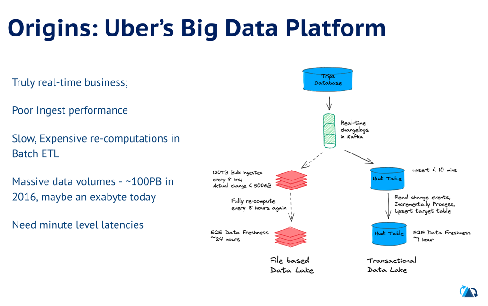
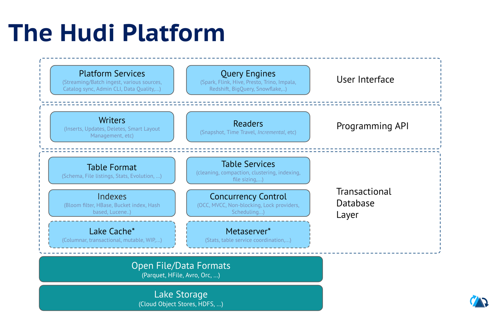
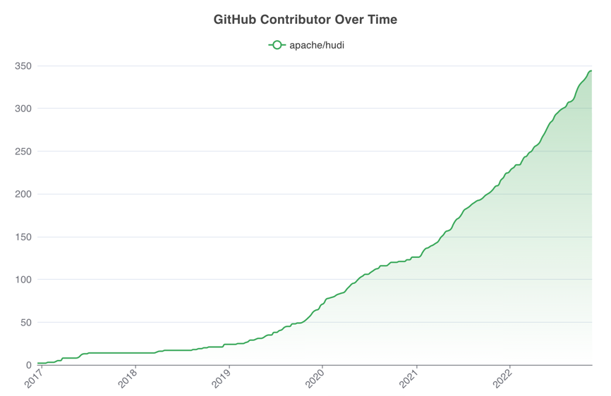

<!--
  Licensed to the Apache Software Foundation (ASF) under one or more
  contributor license agreements.  See the NOTICE file distributed with
  this work for additional information regarding copyright ownership.
  The ASF licenses this file to You under the Apache License, Version 2.0
  (the "License"); you may not use this file except in compliance with
  the License.  You may obtain a copy of the License at

       http://www.apache.org/licenses/LICENSE-2.0

  Unless required by applicable law or agreed to in writing, software
  distributed under the License is distributed on an "AS IS" BASIS,
  WITHOUT WARRANTIES OR CONDITIONS OF ANY KIND, either express or implied.
  See the License for the specific language governing permissions and
  limitations under the License.
-->

# Build On Open Source - Apache Hudi Demo







# Hudi in AWS 


Source: [Onehouse Blog](https://www.onehouse.ai/blog/apache-hudi-native-aws-integrations) 

# Use-case : Tracking abandoned shopping carts

An online retailer wants to email all users who have abandoned their shopping cart (i.e unpurchased items in the cart),
based on user activity events.


## Old school Batch Processing

Batch job that is run every few hours, reprocessing and recomputing the target table every time.

 - Inefficient; too much data read and written. 
 - Poor data freshness.
 - Brittle partition based approach for data arrival tracking.
 - Cannot handle late or out-of-order data.


## Incremental Processing with Hudi

Hudi provides powerful primitives to turn this on its head! change capture and record-level updates! 

 - Efficient; only reads/writes new/changed data
 - Moves data freshness to near real-time
 - Partitions are now just data organization 
 - Correctly process even late date and deal with ordering issues.


# Setup
1. Follow the [Kafka Quickstart](https://kafka.apache.org/quickstart), get it running locally on port 9092
2. Install kcat, a command-line utility to publish/consume from kafka topics, using  `brew install kcat`.
3. Follow the [Spark Quickstart](https://spark.apache.org/docs/latest/quick-start.html) to get Apache Spark installed, with `spark-shell`, `spark-submit` working.
4. Download or clone this repo and `cd build_on_oss_S1E7`
5. Create a folder to hold all demo data `rm -rf /tmp/hudi-demo && mkdir -p /tmp/hudi-demo`
6. Copy files needed by demo to that folder `cp -rf files /tmp/hudi-demo/`
7. Spin up a Spark Shell as below

```shell
spark-shell \
 --packages org.apache.hudi:hudi-spark3.2-bundle_2.12:0.12.1 \
 --conf 'spark.serializer=org.apache.spark.serializer.KryoSerializer' \
 --conf 'spark.sql.catalog.spark_catalog=org.apache.spark.sql.hudi.catalog.HoodieCatalog' \
 --conf 'spark.sql.extensions=org.apache.spark.sql.hudi.HoodieSparkSessionExtension' \
 --conf 'spark.sql.warehouse.dir=file:///tmp/hudi-demo/hudi-warehouse'
```

# [Step 1] Setup "users" table

Create a Hudi table from the csv file containing users

```scala worksheet
import scala.collection.JavaConversions._
import org.apache.spark.sql.SaveMode._
import org.apache.hudi.DataSourceReadOptions._
import org.apache.hudi.DataSourceWriteOptions._
import org.apache.hudi.config.HoodieWriteConfig._

val df = spark.read.option("header","true").option("inferSchema", "true").csv("file:///tmp/hudi-demo/files/user_details.csv")

df.write.format("hudi").
  option(RECORDKEY_FIELD_OPT_KEY, "user_id").
  option("hoodie.table.name", "user_details").
  option(OPERATION_OPT_KEY,"bulk_insert").
  mode(Overwrite).
  save("file:///tmp/hudi-demo/user_details")
```

# [Step 2] Pump some user activity events into Kafka

```shell
cat /tmp/hudi-demo/files/sorted_mock_data_batch1.json | kcat -b localhost -t user_events -P
```

To check if the new topic shows up, use
```shell
kcat -b localhost -L -J | jq .
```

# [Step 3] Kickoff Hudi Streamer in continuous mode

Download the hudi utilities jar

```shell
wget  https://repo1.maven.org/maven2/org/apache/hudi/hudi-utilities-slim-bundle_2.12/0.12.1/hudi-utilities-slim-bundle_2.12-0.12.1.jar
```

```scala
spark-submit \
 --packages org.apache.hudi:hudi-spark3.2-bundle_2.12:0.12.1 \
 --conf 'spark.serializer=org.apache.spark.serializer.KryoSerializer' \
 --class org.apache.hudi.utilities.deltastreamer.HoodieDeltaStreamer \
 hudi-utilities-slim-bundle_2.12-0.12.1.jar \
 --table-type COPY_ON_WRITE \
 --op BULK_INSERT \
 --source-class org.apache.hudi.utilities.sources.JsonKafkaSource \
 --target-base-path file:///tmp/hudi-demo/user_events_cow \
 --target-table user_events_cow --props file:///tmp/hudi-demo/files/kafka-source.properties \
 --continuous \
 --min-sync-interval-seconds 60 \
 --schemaprovider-class org.apache.hudi.utilities.schema.FilebasedSchemaProvider
 ```

# [Step 4] Querying table in Spark SQL

```scala
val user_events_df = spark.read.format("hudi").load("file:///tmp/hudi-demo/user_events_cow")
user_events_df.createOrReplaceTempView("user_events")

val user_profile_df = spark.read.format("hudi").load("file:///tmp/hudi-demo/user_details")
user_profile_df.createOrReplaceTempView("user_profiles")

user_events_df.printSchema
user_profile_df.printSchema

// Query the table to get all purchased events after certain date
spark.sql("select  count(*) from user_events where event_time_date > '2022-11-10' and action_type='purchased'").show(100, false)

// Query the table to get count of users who has a non empty cart in last one week
spark.sql("select count(*) from user_events where event_time_date > '2022-11-10' and cart_empty = false").show(100, false)
```

# [Step 5] Incremental Query to compute abandoned carts

Fetch change stream from user_events table:

```scala
val beginCommitTime = "0"
val user_events_df = spark.read.format("hudi").
     | option(QUERY_TYPE_OPT_KEY, QUERY_TYPE_INCREMENTAL_OPT_VAL).
     | option(BEGIN_INSTANTTIME_OPT_KEY, beginCommitTime).
     | load("file:///tmp/hudi-demo/user_events_cow")
```

Enrich with email id
```scala
val user_events_projected_df =  user_events_df.select("user_id","cart_empty","event_time_ts","last_logged_on")
val user_profiles_projected_df=user_profile_df.select(col("user_id").alias("user_profile_id"),col("email"))
val user_cart_status_df = user_events_projected_df.join(user_profiles_projected_df, user_events_projected_df("user_id") === user_profiles_projected_df("user_profile_id"), "left")
```

Upsert into user_cart_status Hudi table
```scala
user_cart_status_df.write.format("hudi").
  option(RECORDKEY_FIELD_OPT_KEY, "user_id").
  option(TABLE_NAME, "user_cart_status").
  option(PARTITIONPATH_FIELD_OPT_KEY, "").
  option(KEYGENERATOR_CLASS_NAME.key, "org.apache.hudi.keygen.NonpartitionedKeyGenerator").
  option(PRECOMBINE_FIELD_OPT_KEY, "event_time_ts").
  option(OPERATION_OPT_KEY,"upsert").
  option(PAYLOAD_CLASS_OPT_KEY, "org.apache.hudi.common.model.DefaultHoodieRecordPayload").
  mode(Append).
  save("file:///tmp/hudi-demo/user_cart_status")
```

# [Step 6] Pump some more user activity events into Kafka

```shell
cat /tmp/hudi-demo/files/sorted_mock_data_batch2.json | kcat -b localhost -t user_events -P
```

Watch the Streamer kick into action and perform a second commit and repeat step 4 above with the new commit time. 

```scala
val beginCommitTime = "<FIRST_COMMIT_TIME>"
val user_events_df = spark.read.format("hudi").
     | option(QUERY_TYPE_OPT_KEY, QUERY_TYPE_INCREMENTAL_OPT_VAL).
     | option(BEGIN_INSTANTTIME_OPT_KEY, beginCommitTime).
     | load("file:///tmp/hudi-demo/user_events_cow")
user_events_df.select("_hoodie_commit_time").distinct.show
```

Tip: Writing Incremental ETLs via the Hudi Streamer will automate this checkpoint management! 

Query abandoned cart from last 7 days up until 5 hours ago. 

```scala
val user_cart = spark.read.format("hudi").load("file:///tmp/hudi-demo/user_cart_status")
user_cart.createOrReplaceTempView("user_cart_status")
spark.sql("select user_id, email, last_logged_on from user_cart_status where cart_empty = true and last_logged_on < cast('2022-11-17 00:00:00' as TIMESTAMP) - INTERVAL 5 hours and last_logged_on > cast('2022-11-17 00:00:00' as TIMESTAMP) - INTERVAL 7 days").show()
spark.sql("select count(*) from user_cart_status where cart_empty = true and last_logged_on < cast('2022-11-17 00:00:00' as TIMESTAMP) - INTERVAL 5 hours and last_logged_on > cast('2022-11-17 00:00:00' as TIMESTAMP) - INTERVAL 7 days").show()
```
Note: example uses a fixed time for consistent results with test data. 

*Future Idea* : Reverse stream results into Kafka! Coming soon ;)!

## Join Our Community! 



